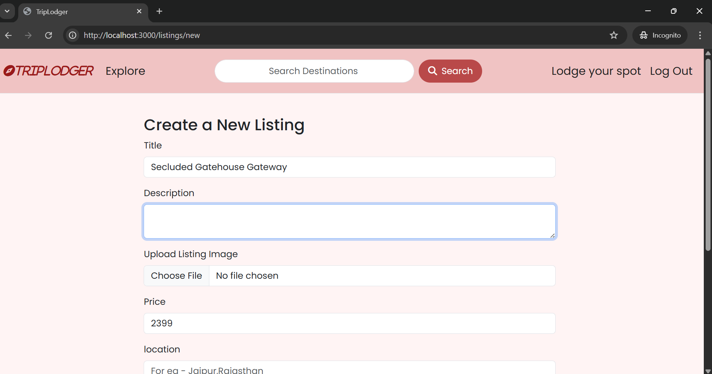
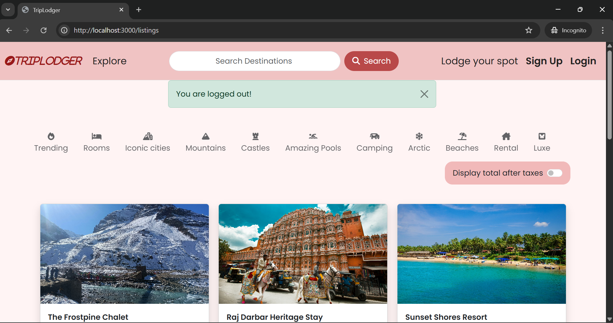
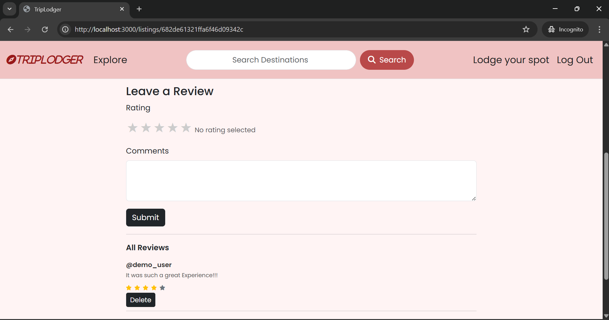

# TripLodger

**Your Gateway to Unforgettable Stays**

TripLodger is a dynamic and intuitive web application designed to connect travelers with unique lodging experiences around the globe. From cozy chalets in snowy mountains to luxurious heritage stays and serene beach resorts, TripLodger offers a diverse range of accommodations tailored to every adventure.

)

---

## Features

* **Detailed Listing Pages:**  
  Each listing provides comprehensive information, including pricing (with transparent GST calculation), images, and more.  
  )
   

* **User Authentication:**  
  Securely sign up and log in to manage your preferences and interact with listings.  
  )
  

* **Review System (Planned/Implemented):**  
  Contribute to the community by sharing your experiences through reviews.  
  

* **Responsive Design:**  
  Enjoy a consistent and engaging experience across various devices.  
  
)

* **Flash Messages:**  
  Receive instant feedback on user actions (e.g., successful sign-up, login errors).  
  
) (
)

---

##  Technologies Used

TripLodger is built on a robust and scalable stack:

### Frontend:
- **EJS (Embedded JavaScript)**
- **HTML5 & CSS3**
- **Bootstrap** (for responsive and modern UI components)

### Backend:
- **Node.js**
- **Express.js**
- **Mongoose**

### Database:
- **MongoDB Atlas**

### Authentication:
- **Passport.js**
- **Passport-Local**

### Other Libraries:
- `express-session`
- `connect-flash`
- `method-override`
- `ejs-mate`
- `dotenv`
- **Cloudinary** (for image storage and delivery)

---

##  Getting Started

Follow these steps to get a local copy of TripLodger up and running on your machine for development and testing purposes.

### Prerequisites

Ensure you have the following installed:

* [Node.js](https://nodejs.org/en/download/)
* [MongoDB Community Server](https://www.mongodb.com/try/download/community)
* [Git](https://git-scm.com/downloads)

---

### Installation

1. **Clone the Repository:**

```bash
git clone https://github.com/drishti2904/TripLodger.git
cd TripLodger/major_project
